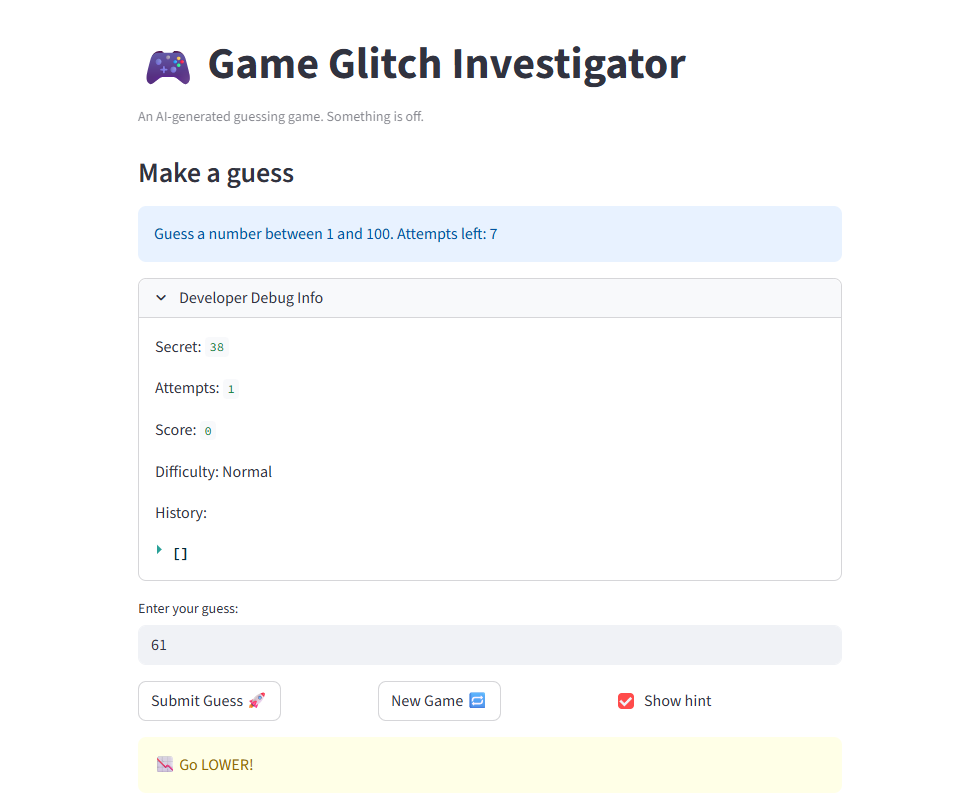
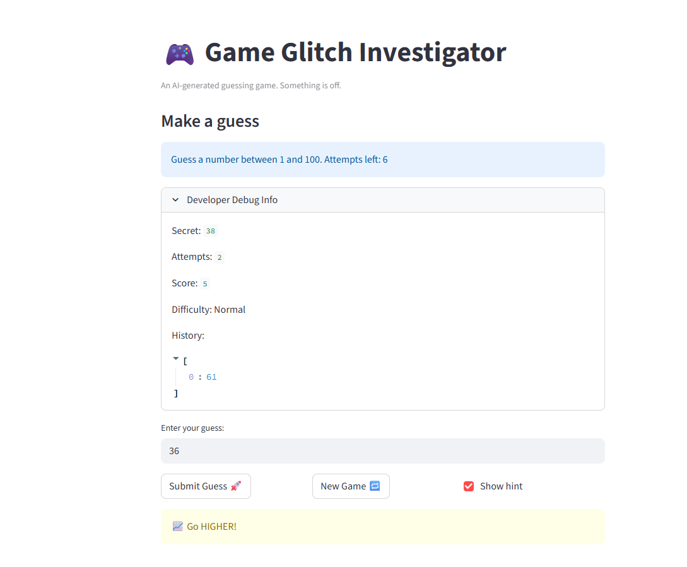
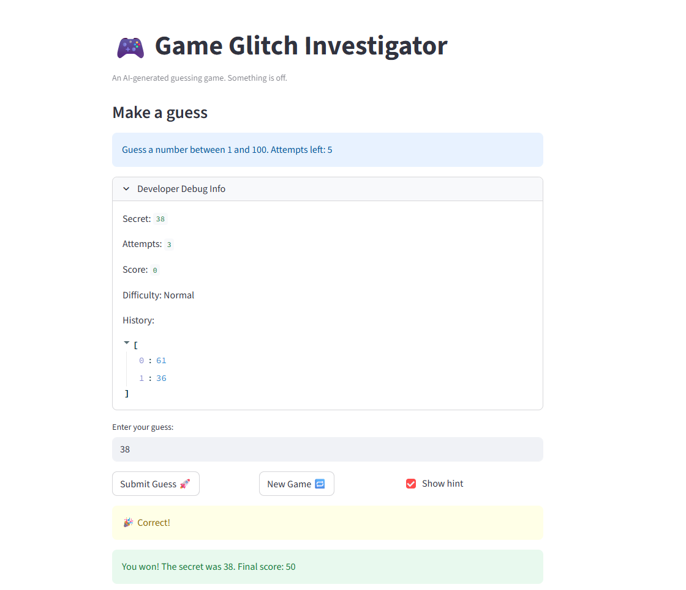

# 🎮 Game Glitch Investigator: The Impossible Guesser

## 🚨 The Situation

You asked an AI to build a simple "Number Guessing Game" using Streamlit.
It wrote the code, ran away, and now the game is unplayable. 

- You can't win.
- The hints lie to you.
- The secret number seems to have commitment issues.

## 🛠️ Setup

1. Install dependencies: `pip install -r requirements.txt`
2. Run the broken app: `python -m streamlit run app.py`

## 🕵️‍♂️ Your Mission

1. **Play the game.** Open the "Developer Debug Info" tab in the app to see the secret number. Try to win.
2. **Find the State Bug.** Why does the secret number change every time you click "Submit"? Ask ChatGPT: *"How do I keep a variable from resetting in Streamlit when I click a button?"*
3. **Fix the Logic.** The hints ("Higher/Lower") are wrong. Fix them.
4. **Refactor & Test.** - Move the logic into `logic_utils.py`.
   - Run `pytest` in your terminal.
   - Keep fixing until all tests pass!

## 📝 Document Your Experience

**Game purpose:** A number guessing game where the player tries to guess a secret number within a limited number of attempts. The game gives Higher/Lower hints after each guess and tracks a score across attempts. Difficulty levels (Easy, Normal, Hard) change the number range and attempt limit.

**Bugs found:**
- The Higher/Lower hints were reversed — "Go HIGHER!" showed when the guess was too high, and "Go LOWER!" when too low.
- On every even-numbered attempt, the secret was silently cast to a `str`, causing numeric comparisons to fail and hints to be wrong.
- The "New Game" button appeared to work but the game stayed stuck after a win or loss because `st.session_state.status` was never reset to `"playing"`.
- All logic functions were missing from `logic_utils.py` (stubs raised `NotImplementedError`).

**Fixes applied:**
- Swapped the hint messages in `check_guess` so `guess > secret` → "Go LOWER!" and `guess < secret` → "Go HIGHER!".
- Removed the even/odd attempt branching that cast the secret to a string.
- Added `st.session_state.status = "playing"` (plus `history` and `score` resets) to the New Game handler.
- Moved all four logic functions (`get_range_for_difficulty`, `parse_guess`, `check_guess`, `update_score`) into `logic_utils.py` and imported them in `app.py`.
- Fixed the pytest tests to unpack the `(outcome, message)` tuple returned by `check_guess`.

## 📸 Demo

## 🚀 Stretch Features

- [ ] [If you choose to complete Challenge 4, insert a screenshot of your Enhanced Game UI here]
